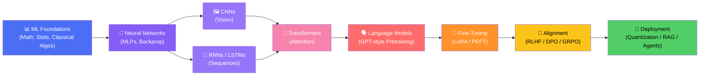
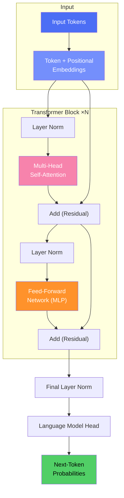

<div align="center">

# 🧠 LLM from Scratch

### Machine Learning • Deep Learning • Large Language Models — Built From First Principles

*A complete, hands-on curriculum for understanding how modern AI actually works.*


</div>

---

## 🗺️ Table of Contents

- [Overview](#-overview)
- [Learning Roadmap](#-learning-roadmap)
- [Repository Structure](#-repository-structure)
- [Getting Started](#-getting-started)
- [Jupyter Kernel Setup](#-jupyter-kernel-setup)
- [GPU Installation Guide](#-gpu-installation-guide)
- [Installation Verification](#-installation-verification)
- [Hardware Requirements](#-hardware-requirements)
- [Machine Learning & Deep Learning Libraries Installation](#-machine-learning--deep-learning-libraries-installation)
- [Optional Packages](#-optional-packages)
- [Dependency Management](#-dependency-management)
- [Troubleshooting](#-troubleshooting)
- [Recommended Learning Order](#-recommended-learning-order)
- [Machine Learning Concepts](#-machine-learning-concepts)
- [Deep Learning Concepts](#-deep-learning-concepts)
- [Large Language Model Concepts](#️-large-language-model-concepts)
- [Transformer Architecture](#-transformer-architecture-at-a-glance)
- [How to Use](#-how-to-use)
- [Learning Objectives](#-learning-objectives)
- [Contributing](#-contributing)
- [License & Contact](#-license--contact)

---

## 📚 Overview

This repository contains **comprehensive educational materials and implementations** of core concepts in **Machine Learning (ML)**, **Deep Learning (DL)**, and **Large Language Models (LLMs)**.

Built entirely with Jupyter Notebooks, this project takes you from the **basics of a single neuron** all the way to **building and fine-tuning a language model from scratch**.

> 💡 **Philosophy:** Don't just use AI — understand every equation, every gradient, and every attention weight behind it.

---

## 🧭 Learning Roadmap



---

## 📁 Repository Structure

```
LLM_from_scratch/
├── 📂 machine learning/     # Machine Learning fundamentals
├── 📂 Deep learning/        # Deep Learning concepts and implementations
├── 📂 pdf/                  # Reference materials and documentation
└── 📄 README.md             # This file
```

| Section | Description |
|---------|-------------|
| **🤖 `machine learning/`** | Supervised & unsupervised learning, feature engineering, classical algorithms, ensembles, and evaluation metrics. |
| **🧬 `Deep learning/`** | Neural networks, CNNs, RNNs, autoencoders, GANs, transformers, and modern training techniques. |
| **📄 `pdf/`** | Reference papers, curated documentation, cheat sheets, and supplementary learning materials. |

---

## 🚀 Getting Started

### ✅ Prerequisites

| Requirement | Details |
|---|---|
| 🐍 Python | **3.10+** (newer versions are fine as long as your required packages support them) |
| 📓 Jupyter Notebook / JupyterLab | Latest |
| 📦 Core Libraries | NumPy, Pandas, Matplotlib, Scikit-learn |
| 🔥 DL Framework | PyTorch or TensorFlow |
| 🤗 LLM Tooling | Transformers, Tokenizers, Datasets (optional) |

> ℹ️ This project uses **Python's built-in `venv`** for environment management — no Conda, Docker, Poetry, or uv required, keeping setup lightweight and beginner-friendly.

### ⚙️ Installation

**1. Clone the repository**

```bash
git clone https://github.com/INCYBIC-TC/LLM_from_scratch.git
cd LLM_from_scratch
```

**2. Create a virtual environment**

<table>
<tr><th>🪟 Windows</th><th>🐧 Linux / macOS</th></tr>
<tr>
<td>

```bash
python -m venv venv
```

</td>
<td>

```bash
python3 -m venv venv
```

</td>
</tr>
</table>

**3. Activate the virtual environment**

<table>
<tr><th>🪟 Windows (PowerShell)</th><th>🐧 Linux / macOS</th></tr>
<tr>
<td>

```powershell
venv\Scripts\Activate.ps1
```

</td>
<td>

```bash
source venv/bin/activate
```

</td>
</tr>
</table>

> 🪟 **Windows (cmd.exe)** users can instead run `venv\Scripts\activate.bat`.
> If PowerShell blocks the script, run `Set-ExecutionPolicy -Scope Process -ExecutionPolicy Bypass` first.

**4. Upgrade pip**

<table>
<tr><th>🪟 Windows</th><th>🐧 Linux / macOS</th></tr>
<tr>
<td>

```bash
python -m pip install --upgrade pip
```

</td>
<td>

```bash
pip install --upgrade pip
```

</td>
</tr>
</table>

**5. Install dependencies**

```bash
pip install -r requirements.txt
```

**6. Launch Jupyter Notebook**

```bash
jupyter notebook
```

**7. Or launch JupyterLab**

```bash
jupyter lab
```

---

## 🧩 Jupyter Kernel Setup

To make sure notebooks run inside your virtual environment (and not some other Python install), register a dedicated Jupyter kernel.

**1. Install `ipykernel`**

```bash
pip install ipykernel
```

**2. Register the kernel**

```bash
python -m ipykernel install --user \
--name=llm-from-scratch \
--display-name="Python (LLM from Scratch)"
```

**3. Select the kernel**

Open any notebook in Jupyter Notebook or JupyterLab, then go to:

> `Kernel → Change Kernel → Python (LLM from Scratch)`

This ensures every notebook uses the packages installed in your `venv`.

---

## 🎮 GPU Installation Guide

> GPU acceleration is **optional** but **strongly recommended** for the Deep Learning and LLM notebooks, where training loops and attention computations are significantly faster on a GPU.

### 🔍 Step 1 — Verify your NVIDIA GPU

```bash
nvidia-smi
```

If this command runs successfully and shows your GPU, driver version, and CUDA version, your system is ready for GPU-accelerated installs. If it fails, see the [Troubleshooting](#-troubleshooting) section.

### 🔥 PyTorch (GPU)

PyTorch ships with its own bundled CUDA runtime, so a separate CUDA Toolkit install is generally **not required**.

**Installation**

```bash
pip install torch torchvision torchaudio
```

**Verification**

```python
import torch

print(torch.__version__)
print(torch.cuda.is_available())

if torch.cuda.is_available():
    print(torch.cuda.get_device_name(0))
```

### 🔶 TensorFlow (GPU)

TensorFlow automatically detects and uses supported GPUs once installed correctly.

**Installation**

```bash
pip install tensorflow
```

**Verification**

```python
import tensorflow as tf

print(tf.__version__)
print(tf.config.list_physical_devices("GPU"))
```

---

## ✅ Installation Verification

Run the checks below after setup to confirm everything is working.

| Component | Command | Expected Output |
|---|---|---|
| Python | `python --version` | `Python 3.10.x` or newer |
| pip | `pip --version` | pip version + Python path |
| Jupyter | `jupyter --version` | Lists `notebook`/`jupyterlab` versions |
| PyTorch | `python -c "import torch; print(torch.__version__)"` | e.g. `2.x.x` |
| PyTorch GPU | `python -c "import torch; print(torch.cuda.is_available())"` | `True` (if GPU configured) |
| TensorFlow | `python -c "import tensorflow as tf; print(tf.__version__)"` | e.g. `2.x.x` |
| TensorFlow GPU | `python -c "import tensorflow as tf; print(tf.config.list_physical_devices('GPU'))"` | Non-empty list (if GPU configured) |

---

## 🖥️ Hardware Requirements

### Minimum Requirements

| Component | Specification |
|---|---|
| CPU | Dual-core (Intel i3 / AMD Ryzen 3 or equivalent) |
| RAM | 8 GB |
| Storage | 10 GB free space |
| Python Version | 3.10+ |

### Recommended Requirements

| Component | Specification |
|---|---|
| CPU | Quad-core+ (Intel i5/i7 / AMD Ryzen 5/7 or equivalent) |
| RAM | 16 GB+ |
| SSD | 20 GB+ free space |
| NVIDIA GPU | RTX 2050 or better |
| VRAM | 6 GB+ |

> 🎯 An **NVIDIA RTX 2050 or better** is recommended for a smooth experience with the Deep Learning and LLM fine-tuning notebooks.

---

## 🧪 Machine Learning & Deep Learning Libraries Installation

This section lists **all libraries used across the ML and DL notebooks** in this repository, grouped by topic. Install a group as you reach that section of the curriculum — you don't need everything on day one.

### 📐 Core Scientific Computing

```bash
pip install numpy scipy
```

### 📊 Data Handling & Visualization

```bash
pip install pandas matplotlib seaborn plotly
```

### 🤖 Classical Machine Learning

```bash
pip install scikit-learn
```

Covers: Linear/Logistic Regression, k-NN, Naive Bayes, SVM, Decision Trees, Random Forest, K-Means, Hierarchical Clustering, DBSCAN, PCA, cross-validation, and evaluation metrics.

### 🚀 Boosting Libraries

```bash
pip install xgboost lightgbm catboost
```

### 🔍 Dimensionality Reduction & Advanced Clustering

```bash
pip install umap-learn hdbscan
```

### ⚖️ Imbalanced Data Handling

```bash
pip install imbalanced-learn
```

Provides SMOTE and other resampling techniques.

### 🔗 Association Rule Mining

```bash
pip install mlxtend
```

Covers: Apriori, FP-Growth.

### 🧠 Deep Learning Frameworks

```bash
pip install torch torchvision torchaudio
```

```bash
pip install tensorflow keras
```

> See the [GPU Installation Guide](#-gpu-installation-guide) above for GPU-enabled setup and verification of both frameworks.

### 🖼️ Computer Vision / CNNs

```bash
pip install opencv-python pillow albumentations timm
```

Covers: image loading/augmentation, pretrained CNN architectures (ResNet, VGG, Inception, etc.), transfer learning.

### 🔁 Sequence Models / RNNs

```bash
pip install torchtext
```

> LSTM, GRU, and Seq2Seq layers are built into PyTorch/TensorFlow directly — no extra package needed beyond the core DL framework.

### 🎨 Generative Models (VAEs / GANs / Diffusion)

```bash
pip install torchmetrics diffusers
```

### 🔀 Attention & Transformers (from scratch)

```bash
pip install einops
```

Useful for clean tensor reshaping when implementing multi-head attention and positional encodings by hand.

### 📈 Model Explainability & Evaluation

```bash
pip install shap lime yellowbrick
```

### 🧵 Progress Bars & Utilities

```bash
pip install tqdm joblib
```

### 📦 Install Everything at Once

If you'd rather install every ML/DL library used in this repository in one go:

```bash
pip install numpy scipy pandas matplotlib seaborn plotly scikit-learn xgboost lightgbm catboost umap-learn hdbscan imbalanced-learn mlxtend torch torchvision torchaudio tensorflow keras opencv-python pillow albumentations timm torchtext torchmetrics diffusers einops shap lime yellowbrick tqdm joblib
```

> 💡 This is a heavier install and may take a while — installing group-by-group as you progress through the roadmap is recommended for slower connections or limited disk space.

---

## 📦 Optional Packages

These are **not required** to get started — install them only when a notebook or topic calls for them.

### 🖼️ Computer Vision

```bash
pip install opencv-python
```

### 📊 Data Science

```bash
pip install numpy pandas scipy matplotlib seaborn scikit-learn
```

### 🗣️ LLM Tooling

```bash
pip install transformers datasets tokenizers accelerate
```

### 🎯 Fine-Tuning

```bash
pip install peft bitsandbytes
```

### 📈 Experiment Tracking

```bash
pip install mlflow wandb
```

### 🔎 Retrieval-Augmented Generation (RAG)

```bash
pip install langchain langgraph chromadb faiss-cpu sentence-transformers
```

---

## 🔄 Dependency Management

**Install all dependencies from `requirements.txt`**

```bash
pip install -r requirements.txt
```

**Update `requirements.txt`** after installing new packages

```bash
pip freeze > requirements.txt
```

> 💡 Tip: Keep your `venv` activated whenever you install, update, or freeze dependencies so `requirements.txt` reflects only what this project needs.

---

## 🛠️ Troubleshooting

| Problem | Likely Cause | Solution |
|---|---|---|
| `torch.cuda.is_available()` returns `False` | No compatible GPU/driver, or CPU-only PyTorch installed | Run `nvidia-smi` to confirm GPU is detected, update NVIDIA drivers, then reinstall PyTorch |
| NVIDIA driver missing | GPU drivers not installed | Install the latest driver from [nvidia.com/drivers](https://www.nvidia.com/Download/index.aspx), then reboot |
| CUDA-related errors | Driver/PyTorch/TensorFlow version mismatch | Update GPU drivers, reinstall `torch`/`tensorflow` fresh in a clean `venv` |
| Jupyter kernel missing | `ipykernel` not registered for this env | Re-run the [Jupyter Kernel Setup](#-jupyter-kernel-setup) steps |
| Virtual environment won't activate (Windows) | PowerShell execution policy blocks scripts | Run `Set-ExecutionPolicy -Scope Process -ExecutionPolicy Bypass`, then retry activation |
| `pip install` errors | Outdated pip, network issues, or missing build tools | Run `python -m pip install --upgrade pip` and retry; ensure internet access |
| "Python not found / not recognized" | Python not installed or not in PATH | Install Python 3.10+ from [python.org](https://www.python.org/downloads/) and enable "Add to PATH" during install |
| `requirements.txt` install fails on a specific package | Package needs system-level build tools or unsupported Python version | Install failing package individually to see the exact error, or upgrade/downgrade Python |

---

## 🧭 Recommended Learning Order

```
Machine Learning
       ↓
Neural Networks
       ↓
Deep Learning
       ↓
CNN
       ↓
RNN / LSTM
       ↓
Attention
       ↓
Transformers
       ↓
Large Language Models
       ↓
Fine-tuning
       ↓
RAG
       ↓
Agents
```

> 📌 Following this order builds each concept on top of the last — from classical ML foundations up to modern LLM agents — so nothing feels like a leap.

---

## 🤖 Machine Learning Concepts

### 📐 1. Foundations

- Linear algebra essentials (vectors, matrices, eigenvalues)
- Probability & statistics (distributions, Bayes' theorem, MLE)
- Calculus for optimization (gradients, partial derivatives)
- Bias-variance tradeoff

### 📈 2. Supervised Learning

| Category | Algorithms |
|---|---|
| Regression | Linear, Polynomial, Ridge, Lasso, Elastic Net |
| Classification | Logistic Regression, k-NN, Naive Bayes, SVM |
| Tree-Based | Decision Trees, Random Forest |
| Boosting | AdaBoost, Gradient Boosting, XGBoost, LightGBM, CatBoost |

### 🔍 3. Unsupervised Learning

- Clustering: K-Means, Hierarchical Clustering, DBSCAN
- Dimensionality Reduction: PCA, t-SNE, UMAP
- Anomaly & Outlier Detection
- Association Rule Mining (Apriori, FP-Growth)

### 🛠️ 4. Feature Engineering & Model Preparation

- Scaling & normalization (Standard, MinMax, Robust)
- Encoding categorical variables (One-Hot, Label, Target)
- Feature selection (filter, wrapper, embedded methods)
- Handling missing data & imbalanced datasets (SMOTE)

### 📊 5. Model Evaluation & Optimization

- Cross-validation (k-fold, stratified)
- Confusion matrix, Precision, Recall, F1-score
- ROC-AUC & PR curves
- Hyperparameter tuning (Grid Search, Random Search, Bayesian Optimization)
- Regularization (L1/L2)

---

## 🧬 Deep Learning Concepts

### 🧩 1. Neural Network Fundamentals

- Perceptron & Multi-Layer Perceptrons (MLPs)
- Activation functions (Sigmoid, Tanh, ReLU, GELU, Swish)
- Forward propagation & Backpropagation (chain rule from scratch)
- Loss functions (MSE, Cross-Entropy, Huber)
- Weight initialization (Xavier, He)

### ⚙️ 2. Optimization & Training

- Gradient Descent variants: SGD, Momentum, RMSProp, Adam, AdamW
- Learning rate scheduling & warmup
- Batch Normalization & Layer Normalization
- Dropout & other regularization techniques
- Vanishing / Exploding gradients

### 🖼️ 3. Convolutional Neural Networks (CNNs)

- Convolution, padding, stride & pooling operations
- Classic architectures: LeNet, AlexNet, VGG, ResNet, Inception
- Transfer learning & fine-tuning pretrained CNNs
- Applications: image classification, object detection, segmentation

### 🔁 4. Recurrent Neural Networks (RNNs)

- Vanilla RNNs & the vanishing gradient problem
- LSTM (Long Short-Term Memory)
- GRU (Gated Recurrent Unit)
- Sequence-to-Sequence (Seq2Seq) models
- Bidirectional RNNs

### 🎨 5. Generative Models

- Autoencoders & Denoising Autoencoders
- Variational Autoencoders (VAEs)
- Generative Adversarial Networks (GANs)
- Diffusion models (intro-level concepts)

### 🔀 6. Attention & Transformers

- The attention mechanism (Bahdanau, Luong)
- Self-attention from first principles
- Multi-head attention
- Positional encoding (sinusoidal, learned)
- Encoder-decoder Transformer architecture

---

## 🗣️ Large Language Model Concepts

### 🔡 1. Tokenization & Embeddings

- Byte-Pair Encoding (BPE), WordPiece, SentencePiece
- Word embeddings: Word2Vec, GloVe
- Contextual embeddings & subword tokenization tradeoffs

### 🏗️ 2. Model Architecture

- Decoder-only Transformer (GPT-style) architecture
- Scaled dot-product attention & causal masking
- KV-caching for efficient generation
- Rotary Positional Embeddings (RoPE) & ALiBi
- Mixture of Experts (MoE) basics

### 🎓 3. Pretraining

- Causal Language Modeling (next-token prediction)
- Masked Language Modeling (BERT-style)
- Data preparation, tokenization pipelines & scaling laws
- Loss curves, perplexity & evaluation

### 🎯 4. Fine-Tuning & Efficient Adaptation

- Full fine-tuning vs. parameter-efficient fine-tuning (PEFT)
- LoRA & QLoRA
- Instruction tuning / Supervised Fine-Tuning (SFT)
- Prefix tuning & adapters

### 🤝 5. Alignment & Post-Training

- Reward modeling
- RLHF (Reinforcement Learning from Human Feedback)
- PPO (Proximal Policy Optimization) for LLMs
- DPO (Direct Preference Optimization)
- GRPO (Group-Relative Policy Optimization)

### ⚡ 6. Inference & Deployment

- Quantization (INT8 / INT4, GPTQ, AWQ)
- Flash Attention & memory-efficient inference
- Speculative decoding
- Retrieval-Augmented Generation (RAG)
- Prompt engineering & AI agents

---

## 🔀 Transformer Architecture at a Glance



---

## 📖 How to Use

Each Jupyter Notebook is structured to walk you through a concept end-to-end:

| Section | What You'll Find |
|---|---|
| 📘 **Theory** | Detailed, intuitive explanations of concepts |
| ➗ **Mathematics** | Relevant formulas and derivations |
| 💻 **Implementation** | Working, from-scratch code examples |
| 📊 **Visualization** | Plots and diagrams to build intuition |
| ✏️ **Exercises** | Practice problems for deeper understanding |

> Navigate to the relevant directory and open the notebooks in Jupyter to follow along with the implementations.

---

## 🎯 Learning Objectives

By working through this repository, you will:

- ✅ Master foundational ML and DL concepts from the ground up
- ✅ Implement classical algorithms and neural networks without relying on black-box libraries
- ✅ Understand attention mechanisms and the full Transformer architecture
- ✅ Learn how LLMs are pretrained, fine-tuned, and aligned (RLHF/DPO/GRPO)
- ✅ Explore efficient fine-tuning (LoRA/QLoRA) and inference optimization techniques
- ✅ Gain hands-on experience with Python, PyTorch/TensorFlow, and modern AI tooling

---

## 🤝 Contributing

Contributions are welcome! Feel free to:

- 🐛 Report issues or bugs
- 💡 Suggest new topics or improvements
- 📓 Add new notebooks or examples
- 📝 Improve existing documentation

To contribute: fork the repo, create a feature branch, commit your changes, and open a pull request.

---

## 📝 License & Contact

This project is **open source** and available for **educational purposes**.

📧 For questions or suggestions, please reach out through the repository [issues](https://github.com/INCYBIC-TC/LLM_from_scratch/issues).

---

<div align="center">

### Happy Learning! 🚀

⭐ **If you find this useful, consider starring the repo!** ⭐

</div>
