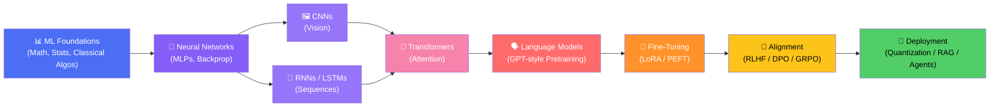
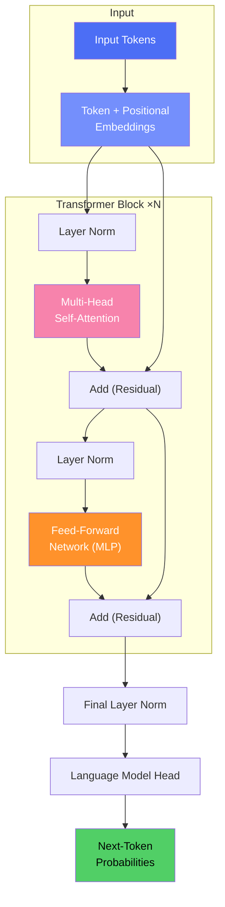

<div align="center">

# 🧠 LLM from Scratch

### Machine Learning • Deep Learning • Large Language Models — Built From First Principles

*A complete, hands-on curriculum for understanding how modern AI actually works.*


</div>

---

## 🗺️ Table of Contents

- [Overview](#-overview)
- [Learning Roadmap](#-learning-roadmap)
- [Repository Structure](#-repository-structure)
- [Getting Started](#-getting-started)
- [Machine Learning Concepts](#-machine-learning-concepts)
- [Deep Learning Concepts](#-deep-learning-concepts)
- [Large Language Model Concepts](#️-large-language-model-concepts)
- [Transformer Architecture](#-transformer-architecture-at-a-glance)
- [How to Use](#-how-to-use)
- [Learning Objectives](#-learning-objectives)
- [Contributing](#-contributing)
- [License & Contact](#-license--contact)

---

## 📚 Overview

This repository contains **comprehensive educational materials and implementations** of core concepts in **Machine Learning (ML)**, **Deep Learning (DL)**, and **Large Language Models (LLMs)**.

Built entirely with Jupyter Notebooks, this project takes you from the **basics of a single neuron** all the way to **building and fine-tuning a language model from scratch**.

> 💡 **Philosophy:** Don't just use AI — understand every equation, every gradient, and every attention weight behind it.

---

## 🧭 Learning Roadmap



---

## 📁 Repository Structure

```
LLM_from_scratch/
├── 📂 machine learning/     # Machine Learning fundamentals
├── 📂 Deep learning/        # Deep Learning concepts and implementations
├── 📂 pdf/                  # Reference materials and documentation
└── 📄 README.md             # This file
```

| Section | Description |
|---------|-------------|
| **🤖 `machine learning/`** | Supervised & unsupervised learning, feature engineering, classical algorithms, ensembles, and evaluation metrics. |
| **🧬 `Deep learning/`** | Neural networks, CNNs, RNNs, autoencoders, GANs, transformers, and modern training techniques. |
| **📄 `pdf/`** | Reference papers, curated documentation, cheat sheets, and supplementary learning materials. |

---

## 🚀 Getting Started

### ✅ Prerequisites

| Requirement | Details |
|---|---|
| 🐍 Python | 3.7+ |
| 📓 Jupyter Notebook | Latest |
| 📦 Core Libraries | NumPy, Pandas, Matplotlib, Scikit-learn |
| 🔥 DL Framework | PyTorch or TensorFlow |
| 🤗 LLM Tooling | Transformers, Tokenizers, Datasets (optional) |

### ⚙️ Installation

**1. Clone the repository**
```bash
git clone https://github.com/INCYBIC-TC/LLM_from_scratch.git
cd LLM_from_scratch
```

**2. Create an environment (recommended)**
```bash
conda create -n llm-from-scratch python=3.11
conda activate llm-from-scratch
```

**3. Install dependencies**
```bash
pip install -r requirements.txt
```

**4. Launch Jupyter Notebook**
```bash
jupyter notebook
```

---

## 🤖 Machine Learning Concepts

### 📐 1. Foundations

- Linear algebra essentials (vectors, matrices, eigenvalues)
- Probability & statistics (distributions, Bayes' theorem, MLE)
- Calculus for optimization (gradients, partial derivatives)
- Bias-variance tradeoff

### 📈 2. Supervised Learning

| Category | Algorithms |
|---|---|
| Regression | Linear, Polynomial, Ridge, Lasso, Elastic Net |
| Classification | Logistic Regression, k-NN, Naive Bayes, SVM |
| Tree-Based | Decision Trees, Random Forest |
| Boosting | AdaBoost, Gradient Boosting, XGBoost, LightGBM, CatBoost |

### 🔍 3. Unsupervised Learning

- Clustering: K-Means, Hierarchical Clustering, DBSCAN
- Dimensionality Reduction: PCA, t-SNE, UMAP
- Anomaly & Outlier Detection
- Association Rule Mining (Apriori, FP-Growth)

### 🛠️ 4. Feature Engineering & Model Preparation

- Scaling & normalization (Standard, MinMax, Robust)
- Encoding categorical variables (One-Hot, Label, Target)
- Feature selection (filter, wrapper, embedded methods)
- Handling missing data & imbalanced datasets (SMOTE)

### 📊 5. Model Evaluation & Optimization

- Cross-validation (k-fold, stratified)
- Confusion matrix, Precision, Recall, F1-score
- ROC-AUC & PR curves
- Hyperparameter tuning (Grid Search, Random Search, Bayesian Optimization)
- Regularization (L1/L2)

---

## 🧬 Deep Learning Concepts

### 🧩 1. Neural Network Fundamentals

- Perceptron & Multi-Layer Perceptrons (MLPs)
- Activation functions (Sigmoid, Tanh, ReLU, GELU, Swish)
- Forward propagation & Backpropagation (chain rule from scratch)
- Loss functions (MSE, Cross-Entropy, Huber)
- Weight initialization (Xavier, He)

### ⚙️ 2. Optimization & Training

- Gradient Descent variants: SGD, Momentum, RMSProp, Adam, AdamW
- Learning rate scheduling & warmup
- Batch Normalization & Layer Normalization
- Dropout & other regularization techniques
- Vanishing / Exploding gradients

### 🖼️ 3. Convolutional Neural Networks (CNNs)

- Convolution, padding, stride & pooling operations
- Classic architectures: LeNet, AlexNet, VGG, ResNet, Inception
- Transfer learning & fine-tuning pretrained CNNs
- Applications: image classification, object detection, segmentation

### 🔁 4. Recurrent Neural Networks (RNNs)

- Vanilla RNNs & the vanishing gradient problem
- LSTM (Long Short-Term Memory)
- GRU (Gated Recurrent Unit)
- Sequence-to-Sequence (Seq2Seq) models
- Bidirectional RNNs

### 🎨 5. Generative Models

- Autoencoders & Denoising Autoencoders
- Variational Autoencoders (VAEs)
- Generative Adversarial Networks (GANs)
- Diffusion models (intro-level concepts)

### 🔀 6. Attention & Transformers

- The attention mechanism (Bahdanau, Luong)
- Self-attention from first principles
- Multi-head attention
- Positional encoding (sinusoidal, learned)
- Encoder-decoder Transformer architecture

---

## 🗣️ Large Language Model Concepts

### 🔡 1. Tokenization & Embeddings

- Byte-Pair Encoding (BPE), WordPiece, SentencePiece
- Word embeddings: Word2Vec, GloVe
- Contextual embeddings & subword tokenization tradeoffs

### 🏗️ 2. Model Architecture

- Decoder-only Transformer (GPT-style) architecture
- Scaled dot-product attention & causal masking
- KV-caching for efficient generation
- Rotary Positional Embeddings (RoPE) & ALiBi
- Mixture of Experts (MoE) basics

### 🎓 3. Pretraining

- Causal Language Modeling (next-token prediction)
- Masked Language Modeling (BERT-style)
- Data preparation, tokenization pipelines & scaling laws
- Loss curves, perplexity & evaluation

### 🎯 4. Fine-Tuning & Efficient Adaptation

- Full fine-tuning vs. parameter-efficient fine-tuning (PEFT)
- LoRA & QLoRA
- Instruction tuning / Supervised Fine-Tuning (SFT)
- Prefix tuning & adapters

### 🤝 5. Alignment & Post-Training

- Reward modeling
- RLHF (Reinforcement Learning from Human Feedback)
- PPO (Proximal Policy Optimization) for LLMs
- DPO (Direct Preference Optimization)
- GRPO (Group-Relative Policy Optimization)

### ⚡ 6. Inference & Deployment

- Quantization (INT8 / INT4, GPTQ, AWQ)
- Flash Attention & memory-efficient inference
- Speculative decoding
- Retrieval-Augmented Generation (RAG)
- Prompt engineering & AI agents

---

## 🔀 Transformer Architecture at a Glance



---

## 📖 How to Use

Each Jupyter Notebook is structured to walk you through a concept end-to-end:

| Section | What You'll Find |
|---|---|
| 📘 **Theory** | Detailed, intuitive explanations of concepts |
| ➗ **Mathematics** | Relevant formulas and derivations |
| 💻 **Implementation** | Working, from-scratch code examples |
| 📊 **Visualization** | Plots and diagrams to build intuition |
| ✏️ **Exercises** | Practice problems for deeper understanding |

> Navigate to the relevant directory and open the notebooks in Jupyter to follow along with the implementations.

---

## 🎯 Learning Objectives

By working through this repository, you will:

- ✅ Master foundational ML and DL concepts from the ground up
- ✅ Implement classical algorithms and neural networks without relying on black-box libraries
- ✅ Understand attention mechanisms and the full Transformer architecture
- ✅ Learn how LLMs are pretrained, fine-tuned, and aligned (RLHF/DPO/GRPO)
- ✅ Explore efficient fine-tuning (LoRA/QLoRA) and inference optimization techniques
- ✅ Gain hands-on experience with Python, PyTorch/TensorFlow, and modern AI tooling

---

## 🤝 Contributing

Contributions are welcome! Feel free to:

- 🐛 Report issues or bugs
- 💡 Suggest new topics or improvements
- 📓 Add new notebooks or examples
- 📝 Improve existing documentation

To contribute: fork the repo, create a feature branch, commit your changes, and open a pull request.

---

## 📝 License & Contact

This project is **open source** and available for **educational purposes**.

📧 For questions or suggestions, please reach out through the repository [issues](https://github.com/INCYBIC-TC/LLM_from_scratch/issues).

---

<div align="center">

### Happy Learning! 🚀

⭐ **If you find this useful, consider starring the repo!** ⭐

</div>
